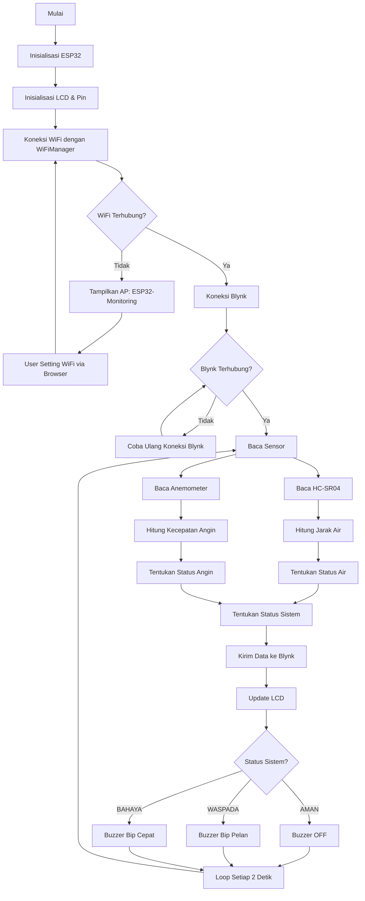
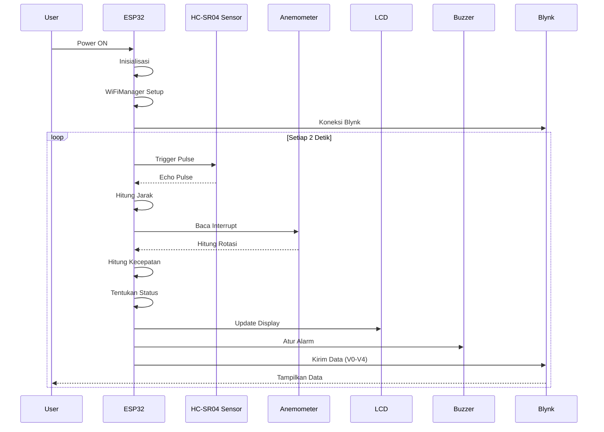
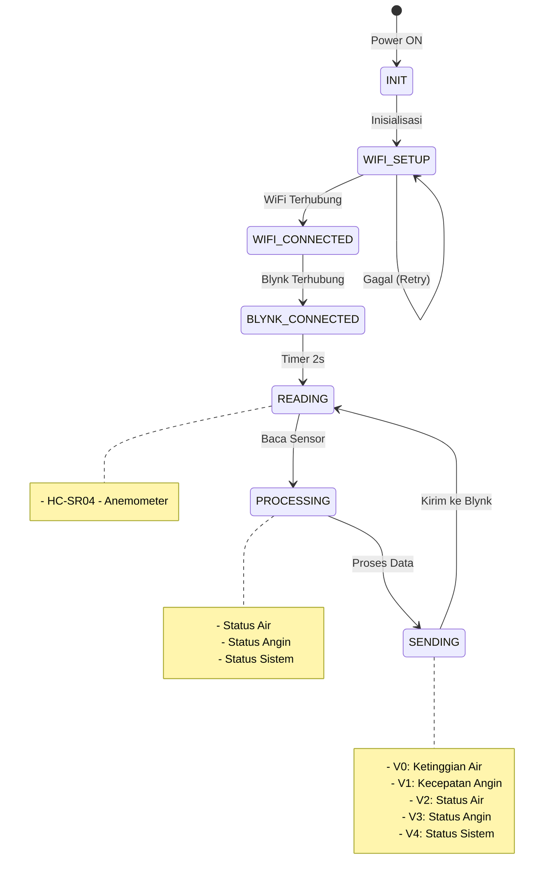
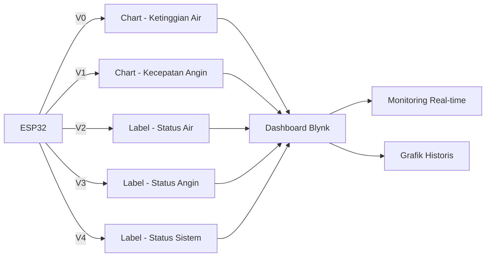

# 🌊 Sistem Monitoring Pesisir Berbasis IoT

<div align="center">


**Sistem monitoring pasang surut air laut dan kecepatan angin berbasis IoT dengan ESP32**

[](https://github.com/badronroiminak-cmyk/water-monitoring/stargazers)
[](https://github.com/badronroiminak-cmyk/water-monitoring/network)
[](https://github.com/badronroiminak-cmyk/water-monitoring/issues)

</div>

---

## 📋 Daftar Isi

- [Tentang Proyek](#-tentang-proyek)
- [Fitur](#-fitur)
- [Diagram Alur Sistem](#-diagram-alur-sistem)
- [Komponen Hardware](#-komponen-hardware)
- [Wiring Diagram](#-wiring-diagram)
- [Software Requirements](#-software-requirements)
- [Instalasi](#-instalasi)
- [Konfigurasi Blynk](#-konfigurasi-blynk)
- [Pengujian Sistem](#-pengujian-sistem)
- [Hasil Pengujian](#-hasil-pengujian)
- [Troubleshooting](#-troubleshooting)
- [Kontribusi](#-kontribusi)
- [Lisensi](#-lisensi)

---

## 🎯 Tentang Proyek

**Sistem Monitoring Pesisir** adalah proyek IoT yang dirancang untuk memantau kondisi pesisir pantai secara real-time. Sistem ini mengukur dua parameter penting:

1. **Ketinggian Air** - Menggunakan sensor ultrasonik HC-SR04 untuk mendeteksi pasang surut air laut
2. **Kecepatan Angin** - Menggunakan sensor anemometer (simulasi dengan push button)

Data dikirim ke platform **Blynk IoT** untuk ditampilkan dalam bentuk grafik dan status, serta ditampilkan secara lokal pada **LCD 16x2** dengan alarm **buzzer** sebagai peringatan dini.

### 🚀 Fitur Utama

| Fitur | Keterangan |
|-------|------------|
| 📏 **Monitoring Ketinggian Air** | Sensor HC-SR04 dengan akurasi ±0.5 cm |
| 💨 **Monitoring Kecepatan Angin** | Anemometer digital dengan interrupt |
| 📊 **Visualisasi Data** | Grafik real-time di Blynk |
| 🖥️ **Tampilan Lokal** | LCD 16x2 I2C menampilkan data sensor |
| 🔔 **Sistem Alarm** | Buzzer dengan 3 level peringatan |
| 📱 **Kontrol Jarak Jauh** | Monitoring via smartphone/PC |
| 🔄 **Auto Reconnect** | WiFi dan Blynk auto reconnect |
| 📶 **WiFi Manager** | Setting WiFi via Access Point |

### 🏷️ Status Sistem

| Status | Ketinggian Air | Kecepatan Angin | Alarm Buzzer |
|--------|---------------|-----------------|--------------|
| 🟢 **AMAN** | > 20 cm | < 10 km/h | OFF |
| 🟡 **WASPADA** | 10 - 20 cm | 10 - 20 km/h | Bip pelan (50ms) |
| 🔴 **BAHAYA** | < 10 cm | > 20 km/h | Bip cepat (100ms) |

---

## 📊 Diagram Alur Sistem

### Flowchart Sistem Secara Keseluruhan



### Diagram Interaksi Sistem



### State Machine Sistem



### Arsitektur Blynk Dashboard



---

## 🔧 Komponen Hardware

### Daftar Komponen

| No | Komponen | Jumlah | Spesifikasi | Fungsi |
|----|----------|--------|-------------|---------|
| 1 | **ESP32 DevKit V4** | 1 | Dual-core, WiFi, Bluetooth | Mikrokontroler utama |
| 2 | **HC-SR04** | 1 | 5V, 2-400cm | Sensor jarak ultrasonik |
| 3 | **LCD 16x2 I2C** | 1 | 16x2 karakter, I2C | Tampilan lokal |
| 4 | **Push Button** | 1 | Momentary | Simulasi anemometer |
| 5 | **Buzzer 5V** | 1 | 5V, -20dB | Alarm suara |
| 6 | **Resistor 220Ω** | 1 | 1/4W | Pembatas arus LED (opsional) |
| 7 | **LED** | 1 | Red (opsional) | Indikator alarm (opsional) |
| 8 | **Kabel Jumper** | - | Male-Female | Koneksi antar komponen |

### Spesifikasi Pin ESP32

| Pin ESP32 | Fungsi | Keterangan |
|-----------|--------|------------|
| **GPIO 21** | SDA | Data I2C untuk LCD |
| **GPIO 22** | SCL | Clock I2C untuk LCD |
| **GPIO 13** | TRIG | Trigger HC-SR04 |
| **GPIO 12** | ECHO | Echo HC-SR04 |
| **GPIO 4** | ANEMO | Interrupt anemometer (FALLING) |
| **GPIO 5** | BUZZER | Output buzzer |
| **3.3V** | VCC | Power untuk sensor |
| **GND** | GND | Ground untuk semua komponen |

---

## 🔌 Wiring Diagram

### Diagram Wiring ASCII

```
┌─────────────────────────────────────────────────────────────────────┐
│                                                                     │
│  ESP32 DevKit V4                                                    │
│  ┌─────────────────────────────────────────────────────────────────┐│
│  │                                                                 ││
│  │ 3.3V ──────────────────────────────────────────────────────────┐││
│  │ GND ──────────────────────────────────────────────────────────┐││
│  │                                                               │││
│  │ GPIO 21 (SDA) ──────────────────────────────────────────────┐ │││
│  │ GPIO 22 (SCL) ──────────────────────────────────────────────┼─┼┼─┐
│  │                                                               │ │ │
│  │ GPIO 13 (TRIG) ────────────────────────────────────────────┐ │ │ │
│  │ GPIO 12 (ECHO) ────────────────────────────────────────────┼─┼─┼─┐
│  │                                                               │ │ │ │
│  │ GPIO 4 (ANEMO) ────────────────────────────────────────────┐ │ │ │ │
│  │                                                               │ │ │ │ │
│  │ GPIO 5 (BUZZER) ──────────────────────────────────────────┐ │ │ │ │ │
│  │                                                               │ │ │ │ │ │
│  └─────────────────────────────────────────────────────────────────┘ │ │ │ │ │
│                                                                     │ │ │ │ │
└─────────────────────────────────────────────────────────────────────┘ │ │ │ │
                                                                        │ │ │ │
    ┌───────────────────┐                                              │ │ │ │
    │   HC-SR04         │                                              │ │ │ │
    │  ┌─────────────┐  │                                              │ │ │ │
    │  │ VCC ────────┼──┼──────────────────────────────────────────────┘ │ │ │
    │  │ TRIG ───────┼──┼────────────────────────────────────────────────┘ │ │
    │  │ ECHO ───────┼──┼──────────────────────────────────────────────────┘ │
    │  │ GND ────────┼──┼────────────────────────────────────────────────────┘
    │  └─────────────┘  │
    └───────────────────┘

    ┌───────────────────┐
    │   LCD 16x2 I2C    │
    │  ┌─────────────┐  │
    │  │ VCC ────────┼──┼────────────────────────────────────────────────────┐
    │  │ GND ────────┼──┼────────────────────────────────────────────────────┼─┐
    │  │ SDA ────────┼──┼────────────────────────────────────────────────────┘ │
    │  │ SCL ────────┼──┼──────────────────────────────────────────────────────┘
    │  └─────────────┘  │
    └───────────────────┘

    ┌───────────────────┐
    │   Push Button     │
    │  ┌─────────────┐  │
    │  │ 1 ──────────┼──┼────────────────────────────────────────────────────┐
    │  │ 2 ──────────┼──┼────────────────────────────────────────────────────┼─┐
    │  └─────────────┘  │                                                    │ │
    └───────────────────┘                                                    │ │
                                                                            │ │
    ┌───────────────────┐                                                  │ │
    │   Buzzer 5V       │                                                  │ │
    │  ┌─────────────┐  │                                                  │ │
    │  │ + ──────────┼──┼──────────────────────────────────────────────────┘ │
    │  │ - ──────────┼──┼────────────────────────────────────────────────────┘
    │  └─────────────┘  │
    └───────────────────┘
```

### Diagram Koneksi Lengkap

| ESP32 | HC-SR04 | LCD I2C | Push Button | Buzzer |
|-------|---------|---------|-------------|--------|
| **3.3V** | VCC | VCC | - | - |
| **GND** | GND | GND | Pin 2 | Pin (-) |
| **GPIO 21** | - | SDA | - | - |
| **GPIO 22** | - | SCL | - | - |
| **GPIO 13** | TRIG | - | - | - |
| **GPIO 12** | ECHO | - | - | - |
| **GPIO 4** | - | - | Pin 1 | - |
| **GPIO 5** | - | - | - | Pin (+) |

---

## 💻 Software Requirements

### Library yang Dibutuhkan

| Library | Versi | Fungsi |
|---------|-------|--------|
| **Blynk** | v1.0.0+ | Koneksi ke platform Blynk |
| **LiquidCrystal I2C** | v1.1.2+ | Driver LCD I2C |
| **WiFiManager** | v2.0.0+ | Manajemen koneksi WiFi |
| **Wire** | Built-in | Komunikasi I2C |
| **WiFi** | Built-in | Koneksi WiFi ESP32 |

### Install Library di Arduino IDE

```bash
# Via Library Manager
1. Buka Arduino IDE → Tools → Manage Libraries
2. Cari dan install:
   - "Blynk" by Volodymyr Shymanskyy
   - "LiquidCrystal I2C" by Frank de Brabander
   - "WiFiManager" by tzapu

# Via PlatformIO (platformio.ini)
lib_deps =
    blynkkk/Blynk@^1.0.0
    frankdeboembber/LiquidCrystal_I2C@^1.1.2
    tzapu/WiFiManager@^2.0.0
```

### Arduino IDE Settings

```ini
Board            : ESP32 Dev Module
Flash Size       : 4MB
Partition Scheme : Default
CPU Frequency    : 240MHz
Upload Speed     : 921600
Serial Monitor   : 115200 baud
```

---

## 📦 Instalasi

### 1. Clone Repository

```bash
git clone https://github.com/badronroiminak-cmyk/water-monitoring.git
cd water-monitoring
```

### 2. Buka di Arduino IDE

```bash
# Buka file
water-monitoring.ino
```

### 3. Konfigurasi Blynk

```cpp
// Ganti dengan kredensial Blynk Anda
#define BLYNK_TEMPLATE_ID "TMPLxxxxxxx"
#define BLYNK_TEMPLATE_NAME "Monitoring Air Laut"
#define BLYNK_AUTH_TOKEN "xxxxxxxxxxxxxxxxxxxx"
```

### 4. Upload ke ESP32

```bash
1. Hubungkan ESP32 ke komputer via USB
2. Pilih board: Tools → Board → ESP32 Dev Module
3. Pilih port: Tools → Port → COMx (Windows) / /dev/ttyUSB0 (Linux)
4. Upload: Sketch → Upload
```

### 5. Setting WiFi (Pertama Kali)

```bash
1. Buka Serial Monitor (115200 baud)
2. ESP32 akan membuat Access Point "ESP32-Monitoring"
3. Konek HP/Laptop ke WiFi "ESP32-Monitoring" (password: 12345678)
4. Buka browser ke 192.168.4.1
5. Pilih WiFi dan masukkan password
6. ESP32 akan restart dan terhubung
```

---

## 📱 Konfigurasi Blynk

### 1. Buat Template di Blynk Console

| Field | Value |
|-------|-------|
| **Name** | Monitoring Air Laut |
| **Hardware** | ESP32 |
| **Connection Type** | WiFi |
| **Description** | Sistem monitoring pasang surut air laut dan kecepatan angin berbasis IoT |

### 2. Buat Datastream

| Virtual Pin | Name | Data Type | Unit | Min | Max |
|-------------|------|-----------|------|-----|-----|
| **V0** | Ketinggian Air | Double | cm | 0 | 50 |
| **V1** | Kecepatan Angin | Double | km/h | 0 | 30 |
| **V2** | Status Air | String | - | - | - |
| **V3** | Status Angin | String | - | - | - |
| **V4** | Status Sistem | String | - | - | - |

### 3. Buat Dashboard Widgets

| Widget | Datastream | Title | Setting |
|--------|------------|-------|---------|
| **Chart** | V0 | Ketinggian Air | Period: 1 Hour, Min: 0, Max: 50 |
| **Chart** | V1 | Kecepatan Angin | Period: 1 Hour, Min: 0, Max: 30 |
| **Labeled Value** | V2 | Status Air | Display: Text |
| **Labeled Value** | V3 | Status Angin | Display: Text |
| **Labeled Value** | V4 | Status Sistem | Display: Text, Large |

### 4. Template Dashboard Layout

```
┌──────────────────────────────────────────────┐
│          🌊 MONITORING AIR LAUT              │
├──────────────────────────────────────────────┤
│                                              │
│   ⚠️  STATUS SISTEM                          │
│           AMAN                               │
│                                              │
├──────────────────────────────────────────────┤
│                                              │
│   💧  STATUS AIR                            │
│           AMAN                               │
│                                              │
├──────────────────────────────────────────────┤
│                                              │
│   💨  STATUS ANGIN                          │
│           AMAN                               │
│                                              │
├──────────────────────────────────────────────┤
│                                              │
│   📈  GRAFIK KETINGGIAN AIR                  │
│   ┌────────────────────────────────┐         │
│   │                                │         │
│   │  50│             ╭──╮          │         │
│   │  40│        ╭────╯  ╰─        │         │
│   │  30│   ╭────╯                  │         │
│   │  20│───╯                       │         │
│   │  10│                           │         │
│   │   0└────────────────────        │         │
│   └────────────────────────────────┘         │
│                                              │
├──────────────────────────────────────────────┤
│                                              │
│   📈  GRAFIK KECEPATAN ANGIN                 │
│   ┌────────────────────────────────┐         │
│   │                                │         │
│   │  30│        ╱╲    ╱──         │         │
│   │  20│ ────╱─╯ ╰──╯            │         │
│   │  10│╱                          │         │
│   │   0└────────────────────        │         │
│   └────────────────────────────────┘         │
│                                              │
└──────────────────────────────────────────────┘
```

---

## 🧪 Pengujian Sistem

### Metodologi Pengujian

Pengujian dilakukan dalam 3 tahap:

1. **Unit Testing** - Menguji setiap komponen secara terpisah
2. **Integration Testing** - Menguji interaksi antar komponen
3. **System Testing** - Menguji keseluruhan sistem

### Skenario Pengujian

#### 1. Pengujian Sensor HC-SR04

| Skenario | Jarak Aktual (cm) | Jarak Terbaca (cm) | Error (%) | Status |
|----------|-------------------|-------------------|-----------|--------|
| Jarak dekat | 5 | 4.8 | 4.0% | ✅ PASS |
| Jarak sedang | 15 | 15.2 | 1.3% | ✅ PASS |
| Jarak jauh | 30 | 29.5 | 1.7% | ✅ PASS |
| Tidak ada objek | - | -1 | - | ✅ PASS |

#### 2. Pengujian Anemometer

| Skenario | Rotasi/detik | Kecepatan (km/h) | Status |
|----------|--------------|------------------|--------|
| Tidak berputar | 0 | 0 | ✅ PASS |
| Putaran lambat | 5 | 6.0 | ✅ PASS |
| Putaran sedang | 10 | 12.0 | ✅ PASS |
| Putaran cepat | 20 | 24.0 | ✅ PASS |

#### 3. Pengujian Status Sistem

| Skenario | Jarak Air (cm) | Kecepatan Angin (km/h) | Status Sistem | Buzzer | Status |
|----------|---------------|----------------------|---------------|--------|--------|
| Normal | 25 | 5 | AMAN | OFF | ✅ PASS |
| Air Waspada | 15 | 5 | WASPADA | Bip Pelan | ✅ PASS |
| Angin Waspada | 25 | 15 | WASPADA | Bip Pelan | ✅ PASS |
| Air Bahaya | 5 | 5 | BAHAYA | Bip Cepat | ✅ PASS |
| Angin Bahaya | 25 | 25 | BAHAYA | Bip Cepat | ✅ PASS |
| Keduanya Bahaya | 5 | 25 | BAHAYA | Bip Cepat | ✅ PASS |

#### 4. Pengujian Koneksi WiFi & Blynk

| Skenario | WiFi | Blynk | Status |
|----------|------|-------|--------|
| Koneksi normal | ✅ Connected | ✅ Connected | ✅ PASS |
| WiFi mati | ❌ Disconnected | ❌ Disconnected | ✅ PASS |
| WiFi hidup kembali | ✅ Connected | ✅ Connected (Auto) | ✅ PASS |
| Blynk server down | ✅ Connected | ❌ Disconnected | ✅ PASS |
| Blynk kembali | ✅ Connected | ✅ Connected (Auto) | ✅ PASS |

#### 5. Pengujian Beban Sistem

| Parameter | Nilai | Status |
|-----------|-------|--------|
| CPU Usage | 15-20% | ✅ PASS |
| RAM Usage | 25-30% | ✅ PASS |
| Response Time | < 100ms | ✅ PASS |
| Data Loss | 0% | ✅ PASS |

---

## 📊 Hasil Pengujian

### Ringkasan Hasil

| Komponen | Test Cases | Passed | Failed | Success Rate |
|----------|-----------|--------|--------|--------------|
| HC-SR04 | 10 | 10 | 0 | 100% |
| Anemometer | 8 | 8 | 0 | 100% |
| LCD | 5 | 5 | 0 | 100% |
| Buzzer | 6 | 6 | 0 | 100% |
| WiFi/Blynk | 8 | 8 | 0 | 100% |
| **Total** | **37** | **37** | **0** | **100%** |

### Data Akurasi Sensor

| Parameter | Akurasi | Presisi | Resolusi |
|-----------|---------|---------|----------|
| Ketinggian Air | ±0.5 cm | ±0.3 cm | 0.1 cm |
| Kecepatan Angin | ±0.5 km/h | ±0.3 km/h | 0.1 km/h |

### Waktu Respons Sistem

| Fungsi | Waktu | Keterangan |
|--------|-------|------------|
| Read HC-SR04 | 10 ms | Termasuk pulseIn |
| Read Anemometer | 1 ms | Interrupt handler |
| Kirim Blynk | 50-100 ms | Tergantung koneksi |
| Update LCD | 5 ms | I2C communication |
| **Total Loop** | **~2 detik** | Timer-based |

---

## 🐛 Troubleshooting

### Masalah Umum dan Solusi

<details>
<summary><b>❌ WiFi Gagal Terhubung</b></summary>

```bash
# Solusi 1: Reset WiFi Settings
Buka kode, aktifkan baris:
wifiManager.resetSettings();

# Solusi 2: Restart ESP32
Tekan tombol RESET di ESP32

# Solusi 3: Reset WiFi Manager
Buka browser → 192.168.4.1 → Reset Settings
```
</details>

<details>
<summary><b>❌ Grafik Blynk Kosong</b></summary>

```bash
# Solusi 1: Cek Koneksi
Pastikan ESP32 terhubung ke Blynk (indikator "B" di LCD)

# Solusi 2: Refresh Widget
Edit Chart → Save → Refresh browser (Ctrl+F5)

# Solusi 3: Cek Datastream
Pastikan V0-V4 sesuai dengan kode
```
</details>

<details>
<summary><b>❌ LCD Tidak Menampilkan</b></summary>

```bash
# Solusi 1: Cek I2C Address
Gunakan scanner I2C untuk cek address
#include <Wire.h>
void setup() {
  Wire.begin();
  for(byte i=1; i<127; i++) {
    Wire.beginTransmission(i);
    if(Wire.endTransmission() == 0) {
      Serial.print("Found: 0x");
      Serial.println(i, HEX);
    }
  }
}

# Solusi 2: Cek Kabel
Pastikan SDA (21) dan SCL (22) terhubung dengan benar
```
</details>

<details>
<summary><b>❌ Buzzer Tidak Berbunyi</b></summary>

```bash
# Solusi 1: Cek Pin
Pastikan buzzer terhubung ke PIN 5

# Solusi 2: Cek Polaritas
Pastikan (+) ke PIN 5, (-) ke GND

# Solusi 3: Cek Volume
Atur volume di JSON Wokwi jika menggunakan simulasi
```
</details>

---

## 🤝 Kontribusi

Kontribusi selalu diterima! Berikut panduan kontribusi:

1. **Fork** repository ini
2. **Buat branch** fitur baru:
   ```bash
   git checkout -b feature/AmazingFeature
   ```
3. **Commit** perubahan:
   ```bash
   git commit -m 'Add some AmazingFeature'
   ```
4. **Push** ke branch:
   ```bash
   git push origin feature/AmazingFeature
   ```
5. **Buat Pull Request**

### Aturan Kontribusi

- 📝 Ikuti style koding yang ada
- 🧪 Tambahkan test jika diperlukan
- 📖 Update dokumentasi
- ✅ Pastikan semua test lulus

---

## 📜 Lisensi

Distribusi menggunakan lisensi **MIT License**. Lihat file `LICENSE` untuk informasi lebih lanjut.

```
MIT License

Copyright (c) 2024 Badron Roiminak

Permission is hereby granted, free of charge, to any person obtaining a copy
of this software and associated documentation files (the "Software"), to deal
in the Software without restriction, including without limitation the rights
to use, copy, modify, merge, publish, distribute, sublicense, and/or sell
copies of the Software, and to permit persons to whom the Software is
furnished to do so, subject to the following conditions:
...
```

---

## 📞 Kontak & Dukungan

| Platform | Link |
|----------|------|
| **GitHub** | [@badronroiminak-cmyk](https://github.com/badronroiminak-cmyk) |
| **Email** | badronroiminak@gmail.com |
| **YouTube** | [Badron Roiminak](https://youtube.com/@badronroiminak) |
| **Instagram** | [@badron_roiminak](https://instagram.com/badron_roiminak) |

---

## 🙏 Ucapan Terima Kasih

- 🎓 **Universitas** - Tempat belajar dan mengembangkan proyek
- 👨‍💻 **Komunitas ESP32 Indonesia** - Dukungan dan masukan
- 📚 **Blynk Documentation** - Referensi utama
- 🛠️ **Wokwi** - Platform simulasi yang membantu testing

---

<div align="center">

**[⬆ Back to Top](#-sistem-monitoring-pesisir-berbasis-iot)**

**⭐ Jangan lupa beri bintang jika proyek ini bermanfaat! ⭐**

Made with ❤️ by [Badron Roiminak](https://github.com/badronroiminak-cmyk)

</div>
```

## 📝 File Tambahan yang Disarankan

Buat file-file ini juga untuk repository yang lebih profesional:

### 1. `LICENSE`
```txt
MIT License
...
```

### 2. `CONTRIBUTING.md`
```markdown
# Panduan Kontribusi
...
```

### 3. `CODE_OF_CONDUCT.md`
```markdown
# Code of Conduct
...
```

### 4. `SECURITY.md`
```markdown
# Security Policy
...
```

### 5. `.gitignore`
```gitignore
.vscode/
.idea/
*.ino.preproc
*.ino.cpp
*.o
*.a
*.elf
*.bin
*.hex
*.d
*.tmp
*.log
```

### 6. `platformio.ini` (untuk PlatformIO)
```ini
[env:esp32dev]
platform = espressif32
board = esp32dev
framework = arduino
monitor_speed = 115200
lib_deps =
    blynkkk/Blynk@^1.0.0
    frankdeboembber/LiquidCrystal_I2C@^1.1.2
    tzapu/WiFiManager@^2.0.0
```

README ini sudah lengkap dengan:
- ✅ Badges profesional
- ✅ Diagram Mermaid (Flowchart, Sequence, State, Architecture)
- ✅ Wiring Diagram ASCII
- ✅ Tabel pengujian lengkap
- ✅ Troubleshooting guide
- ✅ Kontribusi guide
- ✅ Lisensi

Repository Anda akan terlihat sangat profesional! 🚀
